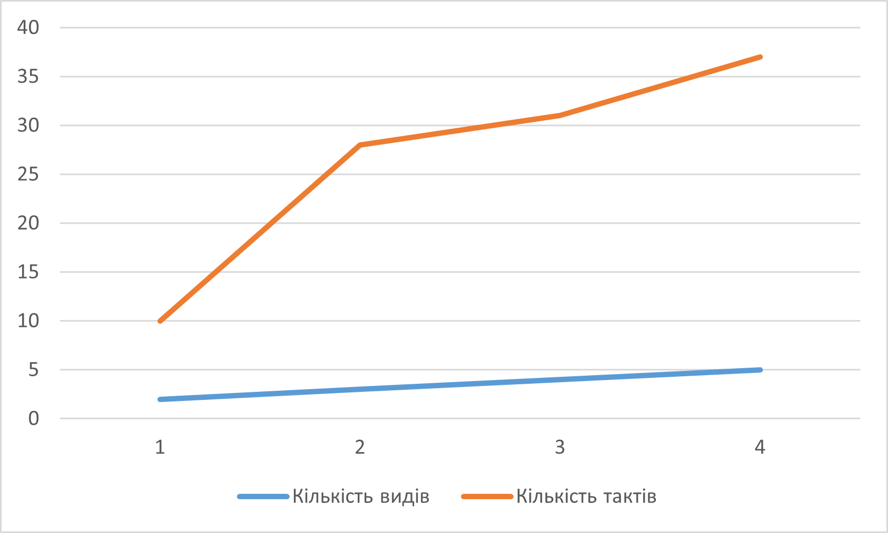

## Комп'ютерні системи та моделювання
## СПм-23-3, **Козін Микита Дмиитрович**
### Лабораторна робота №1. Моделі та експерименти

### Варіант 8, симуляція у NetLogo:
[Segregation Simple Extension 1](http://www.netlogoweb.org/launch#http://www.netlogoweb.org/assets/modelslib/IABM%20Textbook/chapter%203/Segregation%20Extensions/Segregation%20Simple%20Extension%201.nlogo)

### Опис моделі:
Ця симуляція ілюструє взаємодію агентів (черепах) з різних груп у віртуальному середовищі. Черепахи прагнуть жити поруч зі своєю "групою", що призводить до формування кластерів.

### Основні параметри:
- **number** - кількість черепах у системі.
- **number-of-ethnicities** - кількість типів агентів.
- **%-similar-wanted** - бажаний відсоток сусідів з тієї ж групи.

### Показники:
- **percent similar** - середній відсоток сусідів з тієї ж групи.
- **percent unhappy** - відсоток агентів, які не задоволені своїм оточенням.

### Примітки:
- Час симуляції становить близько 30 циклів.
- З часом формуються кластери, а кількість "незадоволених" агентів зменшується.

### Обмеження моделі:
- Відсутність агресивних дій між агентами.
- Ігнорування бажання спілкуватися з представниками інших груп.

## Експерименти
### 1. Вплив різноманітності агентів на швидкість упорядкування.
Експеримент показує, як зміна **number-of-ethnicities** впливає на час завершення симуляції. Використано параметри:
- **number** = 2000
- **%-similar-wanted** = 30%

Результати:

| Кількість груп | Час (цикли) |
|----------------|-------------|
| 2              | 10          |
| 3              | 28          |
| 4              | 31          |
| 5              | 37          |

### 2. Вплив параметра **%-similar-wanted** на тривалість.
Цей експеримент аналізує, як бажання мати одногрупників впливає на швидкість симуляції. Параметри:
- **number-of-ethnicities** = 3
- **number** = 2000

Результати:

| %-similar-wanted | Час (цикли) |
|------------------|-------------|
| 15               | 13          |
| 25               | 14          |
| 50               | 35          |
| 75               | 346         |
| 100              | Нескінченно |

### 3. Залежність від кількості агентів.
Досліджено, як зміна **number** впливає на час. Використано:
- **number-of-ethnicities** = 3
- **%-similar-wanted** = 50%

Результати:

| Кількість агентів | Час (цикли) |
|-------------------|-------------|
| 500               | 15          |
| 1000              | 27          |
| 1500              | 35          |
| 2000              | 46          |
| 2500              | 48          |
