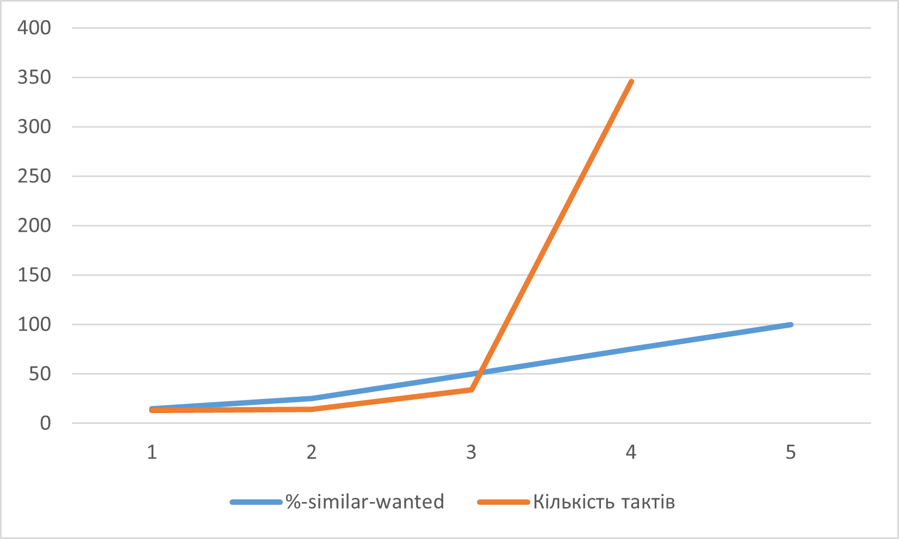

## Комп'ютерні системи та моделювання
## СПм-23-3, **Козін Микита Дмиитрович**
### Лабораторна робота №1. Моделі та експерименти

### Варіант 8, симуляція у NetLogo:
[Segregation Simple Extension 1](http://www.netlogoweb.org/launch#http://www.netlogoweb.org/assets/modelslib/IABM%20Textbook/chapter%203/Segregation%20Extensions/Segregation%20Simple%20Extension%201.nlogo)

### Опис моделі:
Ця симуляція ілюструє взаємодію агентів (черепах) з різних груп у віртуальному середовищі. Черепахи прагнуть жити поруч зі своєю "групою", що призводить до формування кластерів.

### Основні параметри:
- **number** - кількість черепах у системі.
- **number-of-ethnicities** - кількість типів агентів.
- **%-similar-wanted** - бажаний відсоток сусідів з тієї ж групи.

### Показники:
- **percent similar** - середній відсоток сусідів з тієї ж групи.
- **percent unhappy** - відсоток агентів, які не задоволені своїм оточенням.

### Примітки:
- Час симуляції становить близько 30 циклів.
- З часом формуються кластери, а кількість "незадоволених" агентів зменшується.

### Обмеження моделі:
- Відсутність агресивних дій між агентами.
- Ігнорування бажання спілкуватися з представниками інших груп.

## Експерименти
### 1. Вплив різноманітності агентів на швидкість упорядкування.
Експеримент показує, як зміна **number-of-ethnicities** впливає на час завершення симуляції. Використано параметри:
- **number** = 2000
- **%-similar-wanted** = 30%

Результати:

<table>
<thead>
<tr><th>Кількість видів</th><th>Кількість тактів</th></tr>
</thead>
<tbody>
<tr><td>2</td><td>10</td></tr>
<tr><td>3</td><td>28</td></tr>
<tr><td>4</td><td>31</td></tr>
<tr><td>5</td><td>37</td></tr>
</tbody>
</table>

### 2. Вплив параметра **%-similar-wanted** на тривалість.
Цей експеримент аналізує, як бажання мати одногрупників впливає на швидкість симуляції. Параметри:
- **number-of-ethnicities** = 3
- **number** = 2000

Результати:

<table>
<thead>
<tr><th>%-similar-wanted</th><th>Кількість тактів</th></tr>
</thead>
<tbody>
<tr><td>15</td><td>13</td></tr>
<tr><td>25</td><td>14</td></tr>
<tr><td>50</td><td>35</td></tr>
<tr><td>75</td><td>346</td></tr>
<tr><td>100</td><td>Нескінченно</td></tr>
</tbody>
</table>

### 3. Залежність від кількості агентів.
Досліджено, як зміна **number** впливає на час. Використано:
- **number-of-ethnicities** = 3
- **%-similar-wanted** = 50%

Результати:

<table>
<thead>
<tr><th>Початкова кількість агентів</th><th>Кількість тактів</th></tr>
</thead>
<tbody>
<tr><td>500</td><td>15</td></tr>
<tr><td>1000</td><td>27</td></tr>
<tr><td>1500</td><td>35</td></tr>
<tr><td>2000</td><td>46</td></tr>
<tr><td>2500</td><td>48</td></tr>
</tbody>
</table>

